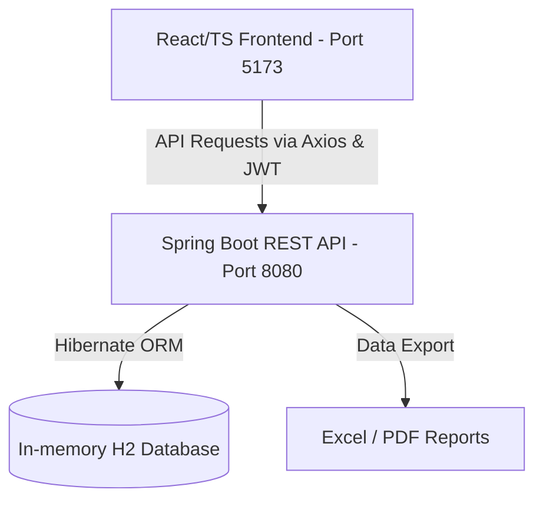

# FactEntry Query & Knowledge Platform

An intelligence workstation and query management portal designed for security reference details, bond discrepancy tracking, and Natural Language duplicate-checking.

## System Architecture Overview

The application follows a decoupled modern single-page-application (SPA) architecture:



---

## Workspace Directory Structure

* `/frontend` — Single Page Application (React, TypeScript, Vite, Material-UI).
* `/backend` — Server REST API (Spring Boot, Java 17+, Hibernate JPA, Spring Security).
* `/db` — PostgreSQL SQL scripts (such as `schema.sql`).

---

## Default Seeded Accounts

The application automatically seeds a clean H2 database on startup with the following user credentials:

| Role | Username / Email | Password | Privileges |
|---|---|---|---|
| **Analyst** | `analyst@example.com` | `password` | Raise queries, check duplicates, upload attachments, view reports. |
| **SME (Expert)** | `sme@example.com` | `password` | Assign queries to self/others, post resolutions/discussion comments, edit case tags. |
| **Admin** | `admin@example.com` | `password` | Complete control, manage users, view system audit trail logs. |

---

## How to Run the Project

Follow these steps to run both the backend server and frontend development server locally.

### Software & Prerequisites Installation

Before running the application, make sure the following software packages are installed on your local machine:

1. **Java Development Kit (JDK 17 or higher)**
   * **Purpose**: Compiles and executes the Spring Boot backend server.
   * **Download**: [Download Eclipse Temurin JDK 17 (Recommended)](https://adoptium.net/temurin/releases/?version=17) or [Oracle JDK 17+](https://www.oracle.com/java/technologies/downloads/).
   * **Verification**: Run `java -version` in your command prompt/terminal. It should report version `17.x.x` or higher.

2. **Node.js & npm (Node v18+ & npm 9+)**
   * **Purpose**: Fetches React packages, compiles TypeScript, and runs the Vite client.
   * **Download**: [Download Node.js LTS (Recommended)](https://nodejs.org/).
   * **Verification**: Run `node -v` and `npm -v` to ensure they are on your system path.

3. **Git (Optional but recommended)**
   * **Purpose**: Version control and codebase cloning.
   * **Download**: [Download Git](https://git-scm.com/downloads).
   * **Verification**: Run `git --version`.

4. **Code Editor / IDE (Recommended)**
   * **Visual Studio Code**: [Download VS Code](https://code.visualstudio.com/). (Recommended extensions: *Extension Pack for Java*, *Spring Boot Extension Pack*, *ESLint*, and *TypeScript*).
   * **IntelliJ IDEA**: [Download IntelliJ IDEA](https://www.jetbrains.com/idea/download/).

---

### Step 1: Run the Backend (Spring Boot)

1. Open a new terminal and navigate to the `backend` directory:
   ```bash
   cd backend
   ```
2. Start the server using the Maven wrapper:
   * **On Windows (PowerShell / Command Prompt)**:
     ```powershell
     .\mvnw.cmd spring-boot:run
     ```
   * **On macOS / Linux (Terminal)**:
     ```bash
     chmod +x mvnw
     ./mvnw spring-boot:run
     ```
3. **Verify API Availability**:
   * The server starts on port `8080` (base URL: `http://localhost:8080/api`).
   * The in-memory database H2 console is accessible at: [http://localhost:8080/h2-console](http://localhost:8080/h2-console)
     * **JDBC URL**: `jdbc:h2:mem:query_platform`
     * **User**: `sa`
     * **Password**: `password`

---

### Step 2: Run the Frontend (React / Vite)

1. Open a separate terminal window and navigate to the `frontend` directory:
   ```bash
   cd frontend
   ```
2. Install the necessary dependencies (run this only on the first setup):
   ```bash
   npm install
   ```
3. Start the Vite development server:
   ```bash
   npm run dev
   ```
4. **Access the App**:
   * Open your browser and navigate to: [http://localhost:5173/](http://localhost:5173/)
   * Log in using any of the default accounts listed in the [Default Seeded Accounts](#default-seeded-accounts) section above.
