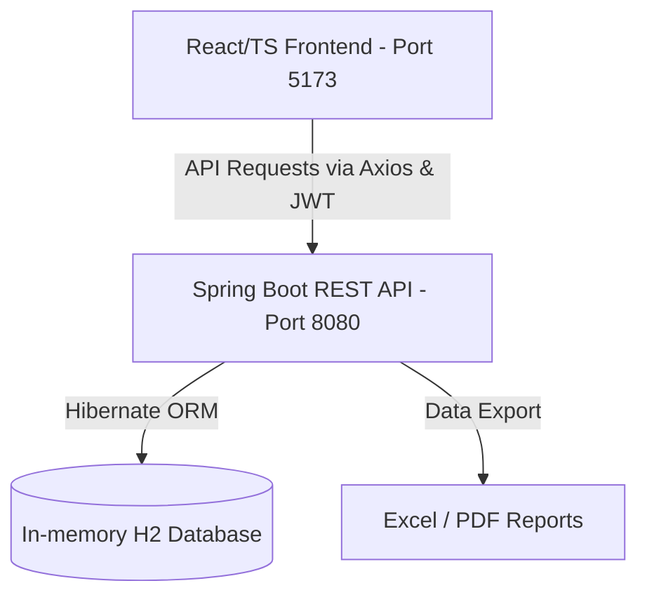

# FactEntry Query & Knowledge Platform

An intelligence workstation and query management portal designed for security reference details, bond discrepancy tracking, and Natural Language duplicate-checking.

## System Architecture Overview

The application follows a decoupled modern single-page-application (SPA) architecture:



---

## Workspace Directory Structure

* `/frontend` — Single Page Application (React, TypeScript, Vite, Material-UI).
* `/backend` — Server REST API (Spring Boot, Java 17+, Hibernate JPA, Spring Security).
* `/db` — PostgreSQL SQL scripts (such as `schema.sql`).

---

## Default Seeded Accounts

The application automatically seeds a clean H2 database on startup with the following user credentials:

| Role | Username / Email | Password | Privileges |
|---|---|---|---|
| **Analyst** | `analyst@example.com` | `password` | Raise queries, check duplicates, upload attachments, view reports. |
| **SME (Expert)** | `sme@example.com` | `password` | Assign queries to self/others, post resolutions/discussion comments, edit case tags. |
| **Admin** | `admin@example.com` | `password` | Complete control, manage users, view system audit trail logs. |

---

## How to Run the Project

Follow these steps to run both the backend server and frontend development server locally.

### Software & Prerequisites Installation

Before running the application, make sure the following software packages are installed on your local machine:

1. **Java Development Kit (JDK 17 or higher)**
   * **Purpose**: Compiles and executes the Spring Boot backend server.
   * **Download**: [Download Eclipse Temurin JDK 17 (Recommended)](https://adoptium.net/temurin/releases/?version=17) or [Oracle JDK 17+](https://www.oracle.com/java/technologies/downloads/).
   * **Verification**: Run `java -version` in your command prompt/terminal. It should report version `17.x.x` or higher.

2. **Node.js & npm (Node v18+ & npm 9+)**
   * **Purpose**: Fetches React packages, compiles TypeScript, and runs the Vite client.
   * **Download**: [Download Node.js LTS (Recommended)](https://nodejs.org/).
   * **Verification**: Run `node -v` and `npm -v` to ensure they are on your system path.

3. **Git (Optional but recommended)**
   * **Purpose**: Version control and codebase cloning.
   * **Download**: [Download Git](https://git-scm.com/downloads).
   * **Verification**: Run `git --version`.

4. **Code Editor / IDE (Recommended)**
   * **Visual Studio Code**: [Download VS Code](https://code.visualstudio.com/). (Recommended extensions: *Extension Pack for Java*, *Spring Boot Extension Pack*, *ESLint*, and *TypeScript*).
   * **IntelliJ IDEA**: [Download IntelliJ IDEA](https://www.jetbrains.com/idea/download/).

---

### Step 1: Run the Backend (Spring Boot)

1. Open a new terminal and navigate to the `backend` directory:
   ```bash
   cd backend
   ```
2. Start the server using the Maven wrapper:
   * **On Windows (PowerShell / Command Prompt)**:
     ```powershell
     .\mvnw.cmd spring-boot:run
     ```
   * **On macOS / Linux (Terminal)**:
     ```bash
     chmod +x mvnw
     ./mvnw spring-boot:run
     ```
3. **Verify API Availability**:
   * The server starts on port `8080` (base URL: `http://localhost:8080/api`).
   * The in-memory database H2 console is accessible at: [http://localhost:8080/h2-console](http://localhost:8080/h2-console)
     * **JDBC URL**: `jdbc:h2:mem:query_platform`
     * **User**: `sa`
     * **Password**: `password`

---

### Step 2: Run the Frontend (React / Vite)

1. Open a separate terminal window and navigate to the `frontend` directory:
   ```bash
   cd frontend
   ```
2. Install the necessary dependencies (run this only on the first setup):
   ```bash
   npm install
   ```
3. Start the Vite development server:
   ```bash
   npm run dev
   ```
4. **Access the App**:
   * Open your browser and navigate to: [http://localhost:5173/](http://localhost:5173/)
   * Log in using any of the default accounts listed in the [Default Seeded Accounts](#default-seeded-accounts) section above.

---

## Future Enhancements: Structured Knowledge Base & Production Database Storage

Currently, the application uses an in-memory H2 database for local testing, and README files are stored as plain files on the local filesystem. A key future upgrade is migrating to a large-scale database (such as PostgreSQL) to store markdown documentation and repository meta-information in a highly structured, relational, or document-based model. 

This enables rich operations like:
* **Full-Text Search**: Run index-optimized lookups across all documentation contents using database text vectors.
* **Inline Editing**: Read and update README files directly from the browser UI by calling REST endpoints that write back to the database.
* **Relationship Mapping**: Model connections between pages, code dependencies, and author roles using database joins.

### Structured Documentation Storage Schema

Below is the proposed database structure to transition from filesystem-based Markdown files to a robust, queryable database system.

#### 1. Relational Database Design (PostgreSQL / MySQL)

For structured storage, auditing, and version tracking, we recommend the following relational layout:

```sql
-- Core Table for Documentation Pages (READMEs, Components, and Knowledge Cards)
CREATE TABLE documentation_nodes (
    id BIGINT GENERATED BY DEFAULT AS IDENTITY PRIMARY KEY,
    title VARCHAR(255) NOT NULL,                    -- Component Name or Section Header
    slug VARCHAR(255) UNIQUE NOT NULL,               -- URL-friendly pathname (e.g. 'layout-component')
    path VARCHAR(512) NOT NULL,                      -- Directory reference (e.g. '/src/components')
    content_markdown TEXT NOT NULL,                 -- Full raw Markdown text
    metadata JSONB,                                 -- Key-value configurations (authors, tags, dependencies)
    parent_id BIGINT REFERENCES documentation_nodes(id) ON DELETE SET NULL, -- Hierarchical folder support
    created_at TIMESTAMP WITH TIME ZONE DEFAULT CURRENT_TIMESTAMP,
    updated_at TIMESTAMP WITH TIME ZONE DEFAULT CURRENT_TIMESTAMP
);

-- Version Tracking Table to keep history of changes
CREATE TABLE documentation_history (
    id BIGINT GENERATED BY DEFAULT AS IDENTITY PRIMARY KEY,
    node_id BIGINT NOT NULL REFERENCES documentation_nodes(id) ON DELETE CASCADE,
    changed_by_id BIGINT NOT NULL,                  -- User ID who made the edit
    content_snapshot TEXT NOT NULL,                 -- Markdown content before change
    change_summary VARCHAR(512),                     -- Commit summary message (e.g., 'Updated setup guide')
    changed_at TIMESTAMP WITH TIME ZONE DEFAULT CURRENT_TIMESTAMP
);

-- Indexing for fast search lookups on text contents
CREATE INDEX idx_doc_nodes_search ON documentation_nodes USING gin (to_tsvector('english', content_markdown));
```

#### 2. Document Store JSON Representation (NoSQL / MongoDB / Elasticsearch)

If storing in a document-based NoSQL database, each structured README/Component file would map to the following JSON schema:

```json
{
  "id": "doc_node_99f34a2e",
  "title": "Layout Component",
  "slug": "layout-component",
  "directoryPath": "/frontend/src/components",
  "contentMarkdown": "# Layout & Guard Components...\n\nDetailed specifications...",
  "hierarchy": {
    "parentId": "doc_node_root_frontend",
    "depth": 2
  },
  "metadata": {
    "author": "admin@example.com",
    "componentScope": "frontend",
    "tags": ["Layout", "UI Shell", "Theme Toggler"],
    "dependencies": ["@mui/material", "framer-motion"]
  },
  "audit": {
    "createdBy": "System Seeder",
    "updatedBy": "Admin User",
    "createdAt": "2026-07-02T21:55:00Z",
    "updatedAt": "2026-07-02T21:55:00Z"
  }
}
```
